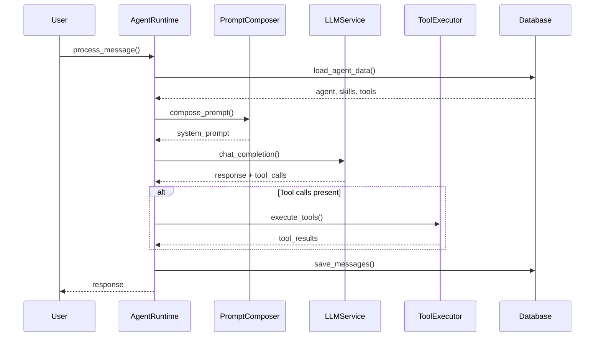

# Agent Runtime Architecture

## Overview

Agent Runtime - это ядро платформы, отвечающее за выполнение ИИ-агента. Он объединяет навыки пользователя, управляет инструментами и взаимодействует с LLM через OpenRouter.

## Компоненты

### 1. AgentRuntime

Основной класс, координирующий весь процесс выполнения агента.

**Ответственности:**
- Загрузка конфигурации агента
- Управление кэшем пользовательских данных
- Оркестрация процесса обработки сообщений
- Сохранение результатов в базу данных

**Ключевые методы:**
```python
async def process_message(user_id, conversation_id, message_content, channel_type)
async def _load_agent_data(user_id)
async def get_agent_status(user_id)
async def update_agent_configuration(user_id, config_updates)
```

### 2. PromptComposer

Формирует системный промпт из различных компонентов.

**Ответственности:**
- Комбинирование базовой идентичности агента
- Интеграция навыков с их конфигурациями
- Добавление описаний инструментов
- Адаптация под канал общения

**Процесс композии:**
1. **Base Identity** - имя и описание агента
2. **Skills Section** - активные навыки с рендерингом шаблонов
3. **Tools Section** - доступные инструменты
4. **Channel Instructions** - инструкции для конкретного канала
5. **Behavioral Guidelines** - общие правила поведения

### 3. ToolExecutor

Управляет выполнением инструментов (function calling).

**Ответственности:**
- Регистрация инструментов
- Валидация аргументов
- Безопасное выполнение
- Сбор статистики

**Встроенные инструменты:**
- `WebSearchTool` - поиск в интернете
- `CalculatorTool` - математические вычисления
- `WeatherTool` - информация о погоде

## Поток выполнения



## Кэширование

Для оптимизации производительности используется кэширование:

- **TTL:** 5 минут
- **Инвалидация:** при обновлении конфигурации
- **Содержимое:** агент, навыки, инструменты

```python
# Кэш валиден?
def _is_cache_valid(user_id: str) -> bool:
    age = (datetime.utcnow() - self._last_cache_update[user_id]).total_seconds()
    return age < self._cache_ttl
```

## Безопасность

### 1. Валидация аргументов
Все аргументы инструментов валидируются против JSON schema:

```python
def validate_arguments(self, arguments: Dict[str, Any]) -> bool:
    schema = self.get_schema()
    required_params = schema.get("parameters", {}).get("required", [])
    
    for param in required_params:
        if param not in arguments:
            raise ToolExecutionError(f"Missing required parameter: {param}")
```

### 2. Безопасное выполнение математических выражений
CalculatorTool использует whitelist разрешенных функций:

```python
allowed_names = {
    "__builtins__": {},
    "abs": abs, "round": round, "min": min, "max": max,
    "sin": math.sin, "cos": math.cos, "sqrt": math.sqrt
}
result = eval(expression, allowed_names, {})
```

### 3. Изоляция инструментов
Каждый инструмент выполняется в изолированном контексте с обработкой ошибок.

## Обработка ошибок

### Иерархия исключений
```python
AgentRuntimeError
├── SkillLoadError
├── ToolExecutionError
├── PromptGenerationError
├── LLMServiceError
└── ConfigurationError
```

### Стратегии обработки
1. **Skill Load Error** - использование базовых навыков
2. **Tool Execution Error** - логирование и продолжение
3. **Prompt Generation Error** - fallback к базовому промпту
4. **LLM Service Error** - retry с exponential backoff

## Метрики и мониторинг

### Статистика выполнения инструментов
```python
{
    "executions": 150,
    "successes": 142,
    "failures": 8,
    "total_time": 45.2,
    "average_time": 0.301,
    "last_used": "2024-01-15T10:30:00Z"
}
```

### Метрики производительности
- Время обработки сообщения
- Размер сгенерированного промпта
- Количество токенов
- Частоту tool calls

## Конфигурация каналов

### Web
- Максимальная длина: 4000 символов
- Форматирование: Markdown
- Стиль: детальные ответы

### Telegram
- Максимальная длина: 2000 символов
- Форматирование: Markdown
- Стиль: краткие ответы

### Voice
- Максимальная длина: 3000 символов
- Форматирование: plain text
- Стиль: естественная речь

## Тестирование

### Unit тесты
- Тестирование каждого компонента изолированно
- Мокирование внешних зависимостей
- Проверка сценариев ошибок

### Интеграционные тесты
- Полный поток обработки сообщения
- Тестирование с реальной базой данных
- Тестирование tool execution

### Performance тесты
- Нагрузочное тестирование
- Тестирование кэширования
- Проверка использования памяти

## Масштабирование

### Горизонтальное масштабирование
- Stateless дизайн AgentRuntime
- Внешнее кэширование (Redis)
- Балансировка нагрузки

### Оптимизации
- Connection pooling для базы данных
- Batch операции для tool calls
- Асинхронное выполнение

## Расширения

### Новые инструменты
```python
class CustomTool(BaseTool):
    async def execute(self, arguments):
        # Custom logic
        pass
    
    def get_schema(self):
        return {
            "name": "custom_tool",
            "description": "Custom tool description",
            "parameters": {...}
        }

# Регистрация
tool_executor.register_tool("custom_tool", CustomTool, config)
```

### Новые каналы
Добавление нового канала требует:
1. Расширения `channel_configs`
2. Обновления `PromptComposer`
3. Адаптации форматирования

### Динамические навыки
Возможность загрузки навыков из внешних источников:
- GitHub репозитории
- Plugin marketplace
- AI-генерируемые навыки
