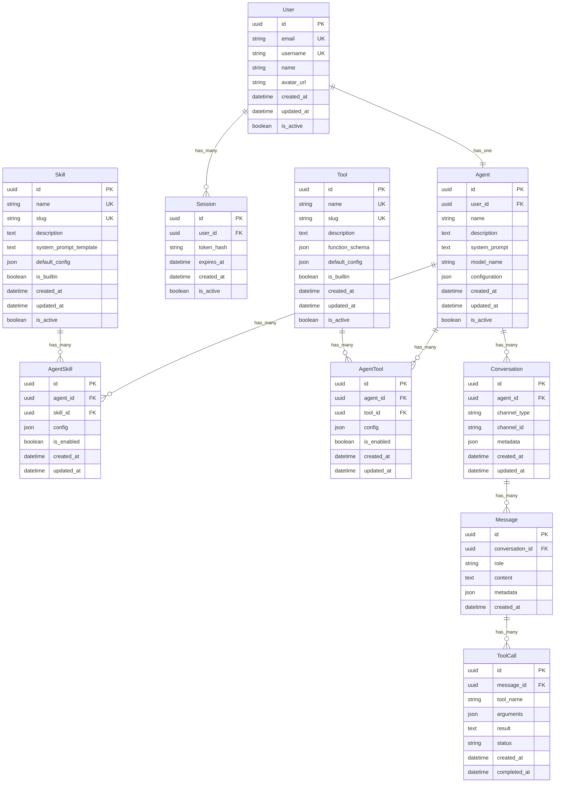

# Database Schema

## Entity Relationship Diagram



## Table Definitions

### Users
Таблица пользователей системы.

**Columns:**
- `id`: UUID первичный ключ
- `email`: Уникальный email
- `username`: Уникальный username
- `name`: Отображаемое имя
- `avatar_url`: URL аватара
- `created_at`, `updated_at`: Timestamps
- `is_active`: Флаг активности

### Agents
Основная сущность - ИИ-агент пользователя.

**Columns:**
- `id`: UUID первичный ключ
- `user_id`: Ссылка на пользователя (один агент на пользователя)
- `name`: Имя агента
- `description`: Описание
- `system_prompt`: Динамический системный промпт (генерируется из навыков)
- `model_name`: Название модели LLM
- `configuration`: JSON с настройками агента
- `created_at`, `updated_at`: Timestamps
- `is_active`: Флаг активности

### Skills
Навыки, которые влияют на поведение агента.

**Columns:**
- `id`: UUID первичный ключ
- `name`: Уникальное название навыка
- `slug`: Уникальный slug для URL
- `description`: Описание навыка
- `system_prompt_template`: Шаблон системного промпта
- `default_config`: JSON с конфигурацией по умолчанию
- `is_builtin`: Встроенный или кастомный навык
- `created_at`, `updated_at`: Timestamps
- `is_active`: Флаг активности

### AgentSkills
Связующая таблица между агентами и навыками.

**Columns:**
- `id`: UUID первичный ключ
- `agent_id`: Ссылка на агента
- `skill_id`: Ссылка на навык
- `config`: JSON с конфигурацией навыка для агента
- `is_enabled`: Включен ли навык
- `created_at`, `updated_at`: Timestamps

### Tools
Инструменты, которые может вызывать агент.

**Columns:**
- `id`: UUID первичный ключ
- `name`: Уникальное название инструмента
- `slug`: Уникальный slug
- `description`: Описание инструмента
- `function_schema`: JSON schema функции для function calling
- `default_config`: JSON с конфигурацией по умолчанию
- `is_builtin`: Встроенный или кастомный инструмент
- `created_at`, `updated_at`: Timestamps
- `is_active`: Флаг активности

### AgentTools
Связующая таблица между агентами и инструментами.

**Columns:**
- `id`: UUID первичный ключ
- `agent_id`: Ссылка на агента
- `tool_id`: Ссылка на инструмент
- `config`: JSON с конфигурацией инструмента
- `is_enabled`: Включен ли инструмент
- `created_at`, `updated_at`: Timestamps

### Conversations
Диалоги агента с пользователями через разные каналы.

**Columns:**
- `id`: UUID первичный ключ
- `agent_id`: Ссылка на агента
- `channel_type`: Тип канала (web, telegram, voice)
- `channel_id`: ID канала (chat_id, session_id и т.д.)
- `metadata`: JSON с метаданными канала
- `created_at`, `updated_at`: Timestamps

### Messages
Сообщения в диалогах.

**Columns:**
- `id`: UUID первичный ключ
- `conversation_id`: Ссылка на диалог
- `role`: Роль (user, assistant, system)
- `content`: Содержимое сообщения
- `metadata`: JSON с метаданными
- `created_at`: Timestamp

### ToolCalls
Вызовы инструментов из сообщений.

**Columns:**
- `id`: UUID первичный ключ
- `message_id`: Ссылка на сообщение
- `tool_name`: Название вызванного инструмента
- `arguments`: JSON с аргументами вызова
- `result`: Результат вызова
- `status`: Статус (pending, completed, failed)
- `created_at`, `completed_at`: Timestamps

### Sessions
Сессии аутентификации пользователей.

**Columns:**
- `id`: UUID первичный ключ
- `user_id`: Ссылка на пользователя
- `token_hash`: Хеш JWT токена
- `expires_at`: Время истечения
- `created_at`: Timestamp
- `is_active`: Флаг активности

## Indexes

```sql
-- Users
CREATE UNIQUE INDEX idx_users_email ON users(email);
CREATE UNIQUE INDEX idx_users_username ON users(username);

-- Agents
CREATE UNIQUE INDEX idx_agents_user_id ON agents(user_id);

-- Skills
CREATE UNIQUE INDEX idx_skills_name ON skills(name);
CREATE UNIQUE INDEX idx_skills_slug ON skills(slug);

-- Tools
CREATE UNIQUE INDEX idx_tools_name ON tools(name);
CREATE UNIQUE INDEX idx_tools_slug ON tools(slug);

-- AgentSkills
CREATE INDEX idx_agent_skills_agent_id ON agent_skills(agent_id);
CREATE INDEX idx_agent_skills_skill_id ON agent_skills(skill_id);
CREATE UNIQUE INDEX idx_agent_skills_unique ON agent_skills(agent_id, skill_id);

-- AgentTools
CREATE INDEX idx_agent_tools_agent_id ON agent_tools(agent_id);
CREATE INDEX idx_agent_tools_tool_id ON agent_tools(tool_id);
CREATE UNIQUE INDEX idx_agent_tools_unique ON agent_tools(agent_id, tool_id);

-- Conversations
CREATE INDEX idx_conversations_agent_id ON conversations(agent_id);
CREATE INDEX idx_conversations_channel ON conversations(channel_type, channel_id);

-- Messages
CREATE INDEX idx_messages_conversation_id ON messages(conversation_id);
CREATE INDEX idx_messages_created_at ON messages(created_at);

-- ToolCalls
CREATE INDEX idx_tool_calls_message_id ON tool_calls(message_id);
CREATE INDEX idx_tool_calls_status ON tool_calls(status);

-- Sessions
CREATE INDEX idx_sessions_user_id ON sessions(user_id);
CREATE INDEX idx_sessions_token_hash ON sessions(token_hash);
CREATE INDEX idx_sessions_expires_at ON sessions(expires_at);
```

## Constraints

```sql
-- Один агент на пользователя
ALTER TABLE agents ADD CONSTRAINT one_agent_per_user 
UNIQUE (user_id);

-- Каскадное удаление
ALTER TABLE agents ADD CONSTRAINT fk_agents_user_id 
FOREIGN KEY (user_id) REFERENCES users(id) ON DELETE CASCADE;

ALTER TABLE agent_skills ADD CONSTRAINT fk_agent_skills_agent_id 
FOREIGN KEY (agent_id) REFERENCES agents(id) ON DELETE CASCADE;

ALTER TABLE agent_skills ADD CONSTRAINT fk_agent_skills_skill_id 
FOREIGN KEY (skill_id) REFERENCES skills(id) ON DELETE CASCADE;

ALTER TABLE agent_tools ADD CONSTRAINT fk_agent_tools_agent_id 
FOREIGN KEY (agent_id) REFERENCES agents(id) ON DELETE CASCADE;

ALTER TABLE agent_tools ADD CONSTRAINT fk_agent_tools_tool_id 
FOREIGN KEY (tool_id) REFERENCES tools(id) ON DELETE CASCADE;

ALTER TABLE conversations ADD CONSTRAINT fk_conversations_agent_id 
FOREIGN KEY (agent_id) REFERENCES agents(id) ON DELETE CASCADE;

ALTER TABLE messages ADD CONSTRAINT fk_messages_conversation_id 
FOREIGN KEY (conversation_id) REFERENCES conversations(id) ON DELETE CASCADE;

ALTER TABLE tool_calls ADD CONSTRAINT fk_tool_calls_message_id 
FOREIGN KEY (message_id) REFERENCES messages(id) ON DELETE CASCADE;

ALTER TABLE sessions ADD CONSTRAINT fk_sessions_user_id 
FOREIGN KEY (user_id) REFERENCES users(id) ON DELETE CASCADE;
```
