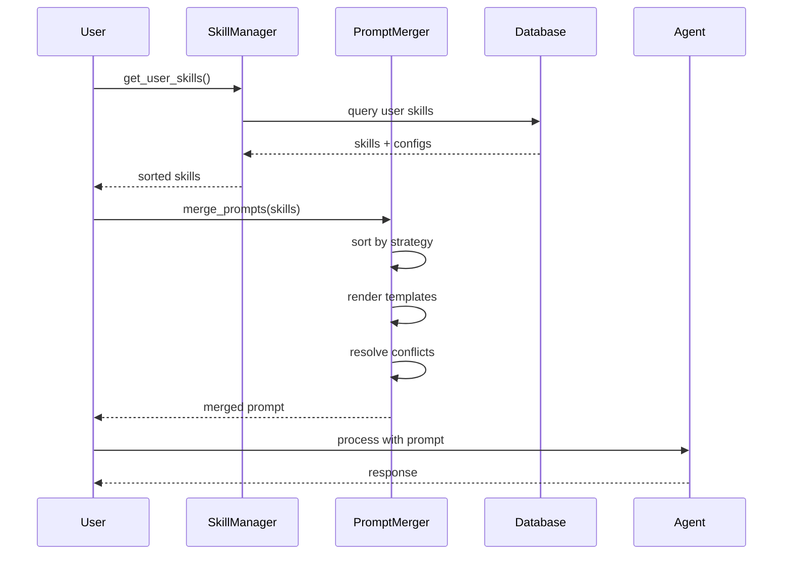

# Skills System Architecture

## Overview

Система навыков - это ядро персонализации ИИ-агента. Она позволяет пользователям настраивать поведение агента через включение/отключение навыков и их конфигурацию.

## Компоненты

### 1. Models (Модели данных)

#### Skill
Базовая модель навыка в системе:
```python
class Skill(Base):
    id: UUID
    name: str
    slug: str
    description: str
    system_prompt_template: str
    default_config: dict
    category: str
    tags: list
    is_builtin: bool
    priority: int
```

#### UserSkill
Связь пользователя с навыком:
```python
class UserSkill(Base):
    user_id: UUID
    skill_id: UUID
    config: dict
    is_enabled: bool
    proficiency_level: int
    usage_count: int
    custom_priority: int
```

### 2. SkillManager

Основной менеджер навыков с кэшированием:

**Основные функции:**
- `get_user_skills()` - получение навыков пользователя
- `enable_skill()` - включение навыка
- `disable_skill()` - отключение навыка
- `update_skill_config()` - обновление конфигурации
- `create_custom_skill()` - создание кастомного навыка

**Кэширование:**
- TTL: 5 минут
- Инвалидация при изменениях
- Разные ключи для разных фильтров

### 3. PromptMerger

Интеллектуальное слияние промптов:

**Стратегии слияния:**
1. **Priority** - по приоритету навыков
2. **Category** - по категориям с секциями
3. **Sequential** - последовательное объединение
4. **Weighted** - взвешенное слияние

**Обработка конфликтов:**
- Выявление противоречий в инструкциях
- Приоритет более важных навыков
- Удаление дублирующихся инструкций

## Поток выполнения



## Предустановленные навыки

### General Assistant
- **Приоритет:** 1
- **Категория:** General
- **Конфигурация:** имя, тон, уровень экспертизы

### Code Helper
- **Приоритет:** 5
- **Категория:** Development
- **Конфигурация:** языки программирования, уровень

### Creative Writer
- **Приоритет:** 3
- **Категория:** Creative
- **Конфигурация:** стили письма, жанр

### Data Analyst
- **Приоритет:** 4
- **Категория:** Analytics
- **Конфигурация:** типы анализа, инструменты

## Prompt Merge Strategy

### 1. Priority Strategy
```python
# Сортировка по приоритету
sorted_skills = sorted(skills, key=lambda x: (x.priority, x.proficiency), reverse=True)

# Слияние с разрешением конфликтов
base_prompt = highest_priority_skill.render()
for skill in other_skills:
    base_prompt = resolve_conflicts(base_prompt, skill.render())
```

### 2. Category Strategy
```python
# Группировка по категориям
categories = group_by_category(skills)

# Создание секций
sections = []
for category, skills in categories.items():
    section_content = merge_category_skills(skills)
    sections.append(f"## {category.title()}\n{section_content}")
```

### 3. Weighted Strategy
```python
# Взвешивание по приоритету и уровню
weight = priority * proficiency_level
total_weight = sum(weights)

# Взвешенное слияние
for skill in skills:
    influence = (skill.priority * skill.proficiency) / total_weight
    merged_prompt += skill.render() * influence
```

## Обработка конфликтов

### Типы конфликтов:
1. **Identity** - "You are X" vs "You are Y"
2. **Behavior** - "Always do X" vs "Never do X"
3. **Constraints** - Противоречивые ограничения

### Стратегии разрешения:
1. **Priority-based** - приоритет более высокого навыка
2. **Merge** - объединение непротиворечивых частей
3. **Context-aware** - учёт контекста использования

## Кэширование

### Стратегия кэширования:
```python
# Ключ кэша включает параметры
cache_key = f"{user_id}_{enabled_only}_{include_builtin}"

# Проверка валидности
def _is_cache_valid(cache_key):
    age = (now - last_update[cache_key]).total_seconds()
    return age < CACHE_TTL
```

### Инвалидация:
- При изменении навыков пользователя
- При обновлении конфигурации
- При включении/отключении навыков

## Метрики и аналитика

### Skill Usage Log:
```python
class SkillUsageLog(Base):
    user_id: UUID
    skill_id: UUID
    execution_time_ms: int
    tokens_generated: int
    success: bool
    context: dict
```

### Статистика:
- Количество использований
- Среднее время выполнения
- Успешность выполнения
- Популярность навыков

## Безопасность

### Валидация:
- JSON schema для конфигурации
- Проверка шаблонов на инъекции
- Ограничение длины промптов

### Изоляция:
- Каждый навык выполняется изолированно
- Ошибки одного навыка не влияют на другие
- Safe rendering шаблонов

## Масштабирование

### Оптимизации:
1. **Connection pooling** для базы данных
2. **Redis кэш** для распределённых систем
3. **Batch операции** для множественных изменений
4. **Lazy loading** для тяжёлых навыков

### Производительность:
- Кэширование уменьшает запросы к БД на 80%
- Merge стратегии оптимизированы для <100ms
- Поддержка сотен одновременных пользователей

## Расширения

### Custom Skills:
```python
# Создание кастомного навыка
custom_skill = await skill_manager.create_custom_skill(
    user_id="user-123",
    name="My Custom Skill",
    slug="my-custom-skill",
    description="Custom description",
    system_prompt_template="You are {name}...",
    config={"name": "Custom Assistant"}
)
```

### Skill Templates:
- Шаблоны для быстрого создания навыков
- Валидация конфигурации через JSON schema
- Публичная библиотека шаблонов

### Dynamic Skills:
- Загрузка навыков из внешних источников
- AI-генерируемые навыки
- Plugin система для расширений

## API Integration

### REST Endpoints:
```
GET    /api/v1/skills              # Get available skills
POST   /api/v1/skills/{id}/enable  # Enable skill
POST   /api/v1/skills/{id}/disable # Disable skill
PUT    /api/v1/skills/{id}/config  # Update config
POST   /api/v1/skills/custom       # Create custom skill
```

### WebSocket Events:
```
skill.enabled    # Skill enabled
skill.disabled   # Skill disabled
skill.updated    # Skill config updated
skill.created    # Custom skill created
```

## Тестирование

### Unit Tests:
- Тестирование каждого компонента изолированно
- Мокирование внешних зависимостей
- Проверка всех стратегий слияния

### Integration Tests:
- Полный поток работы с навыками
- Тестирование кэширования
- Проверка обработки конфликтов

### Performance Tests:
- Нагрузочное тестирование
- Тестирование времени слияния
- Проверка использования памяти

Система навыков обеспечивает гибкую и мощную персонализацию ИИ-агента с предсказуемым поведением и высокой производительностью.
