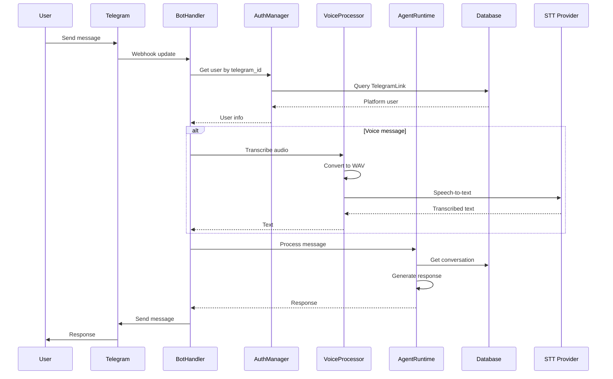

# Telegram Bot Architecture

## Overview

Telegram-бот предоставляет интерфейс для общения с персональным ИИ-агентом пользователя через Telegram. Поддерживает текстовые и голосовые сообщения с интеграцией в Agent Runtime.

## Компоненты

### 1. BotHandler

Основной обработчик Telegram бота:

**Команды:**
- `/start` - приветствие и проверка привязки
- `/link` - генерация токена привязки
- `/unlink` - отвязка аккаунта
- `/status` - статус агента
- `/skills` - активные навыки
- `/settings` - настройки бота

**Обработка сообщений:**
- Текстовые сообщения → Agent Runtime
- Голосовые сообщения → STT → Agent Runtime
- Аудиофайлы → Voice Processor

### 2. VoiceProcessor

Обработка голосовых сообщений:

**Поддерживаемые форматы:**
- OGG (Telegram по умолчанию)
- WAV, MP3, M4A
- Максимальный размер: 20MB
- Максимальная длительность: 5 минут

**STT провайдеры:**
- OpenAI Whisper API
- Google Speech Recognition
- Локальный Whisper

### 3. AuthManager

Управление привязкой аккаунтов:

**Процесс привязки:**
1. Пользователь генерирует токен в боте
2. Переходит по ссылке на платформу
3. Подтверждает привязку
4. Telegram user_id связывается с platform user_id

**Безопасность:**
- JWT токены с TTL 24 часа
- Уникальная привязка один пользователь → один агент
- Soft delete для истории привязок

## Поток обработки сообщений



## Архитектура привязки

### Модель данных
```python
class TelegramLink(Base):
    user_id: UUID              # Platform user ID
    telegram_user_id: BigInteger # Telegram user ID
    telegram_username: String    # Telegram username
    telegram_chat_id: BigInteger # Telegram chat ID
    is_active: Boolean         # Link status
    created_at: DateTime
    updated_at: DateTime
```

### Процесс привязки
1. **Генерация токена**: JWT с telegram_user_id и TTL
2. **Проверка токена**: Валидация JWT на платформе
3. **Создание связи**: Запись в TelegramLink таблицу
4. **Активация**: is_active = True

### Безопасность
- Уникальные telegram_chat_id для предотвращения конфликтов
- Soft delete для сохранения истории
- TTL токенов для безопасности
- Проверка активных привязок

## Обработка голосовых сообщений

### Форматирование аудио
```python
# Конвертация в WAV для STT совместимости
audio = AudioSegment.from_file(input_path)
audio = audio.set_channels(1)      # Mono
audio = audio.set_frame_rate(16000) # 16kHz
audio.export(output_path, format="wav")
```

### STT провайдеры
1. **OpenAI Whisper API**
   - Наилучшее качество
   - Требует API ключ
   - Поддержка множества языков

2. **Google Speech Recognition**
   - Бесплатный вариант
   - Ограничения по использованию
   - Базовое качество

3. **Локальный Whisper**
   - Офлайн обработка
   - Требует ресурсов
   - Настраиваемая модель

### Валидация аудио
- Проверка формата файла
- Ограничение размера (20MB)
- Ограничение длительности (5 минут)
- Проверка на пустые файлы

## Интеграция с Agent Runtime

### Routing сообщений
```python
# Получение или создание диалога
conversation_id = await self._get_or_create_conversation(
    user_id=platform_user_id,
    telegram_chat_id=telegram_chat_id
)

# Обработка через Agent Runtime
response = await self.agent_runtime.process_message(
    user_id=platform_user_id,
    conversation_id=conversation_id,
    message_content=message_text,
    channel_type="telegram"
)
```

### Контекст канала
- `channel_type: "telegram"`
- Адаптация ответов под Telegram
- Поддержка Markdown форматирования
- Ограничение длины сообщений (4096 символов)

## Webhook интеграция

### Настройка webhook
```python
# Установка webhook
await bot.set_webhook(url=webhook_url)

# Обработка обновлений
@app.post("/api/v1/telegram/webhook")
async def webhook(request: Request):
    update_data = await request.json()
    update = Update.de_json(update_data, bot)
    await application.process_update(update)
```

### Безопасность webhook
- Секретный токен для верификации
- HTTPS обязательное требование
- Валидация входящих данных
- Обработка ошибок

## Управление состоянием

### User states
```python
# Хранение состояний пользователя
self._user_states: Dict[int, Dict[str, Any]] = {}

# Пример состояния
user_state = {
    "awaiting_link": True,
    "link_token": "generated_token",
    "last_command": "/link"
}
```

### Контекстные команды
- Многошаговые операции
- Временные данные
- Очистка неактивных состояний

## Метрики и мониторинг

### Логирование
- Все входящие сообщения
- Результаты STT обработки
- Ошибки привязки аккаунтов
- Время обработки запросов

### Аналитика
- Количество активных пользователей
- Частота использования команд
- Популярность голосовых сообщений
- Ошибки и их типы

## Масштабирование

### Оптимизации
1. **Connection pooling** для базы данных
2. **Async обработка** всех операций
3. **Кэширование** пользовательских данных
4. **Batch операции** для массовой рассылки

### Производительность
- Время обработки текста: <100ms
- Время обработки голоса: <5s
- Поддержка сотен одновременных пользователей
- Graceful degradation при нагрузке

## Безопасность

### Защита от злоупотреблений
1. **Rate limiting** на пользователя
2. **Валидация** входящих данных
3. **Проверка привязки** аккаунтов
4. **Ограничения** размера файлов

### Приватность
- Хранение только telegram_user_id
- Возможность отвязки аккаунта
- Удаление истории при запросе
- Соответствие GDPR

## Тестирование

### Unit тесты
- Тестирование обработчиков команд
- Валидация токенов привязки
- Обработка голосовых сообщений
- Интеграция с Agent Runtime

### Integration тесты
- Полный поток привязки аккаунта
- Обработка различных типов сообщений
- Webhook обработка
- Обработка ошибок

### E2E тесты
- Тестирование с реальным Telegram API
- Проверка голосовых сообщений
- Тестирование нагрузки
- Проверка отказоустойчивости

## Развертывание

### Требования
- Python 3.8+
- Telegram Bot Token
- SSL сертификат для webhook
- Доступ к STT провайдерам

### Конфигурация
```python
# .env
TELEGRAM_BOT_TOKEN="your_bot_token"
TELEGRAM_WEBHOOK_URL="https://your-domain.com/api/v1/telegram/webhook"
OPENAI_API_KEY="your_openai_key"
```

### Мониторинг
- Health checks для webhook
- Логи ошибок и предупреждений
- Метрики производительности
- Алерты при сбоях

Telegram бот обеспечивает удобный интерфейс для взаимодействия с персональным ИИ-агентом с поддержкой голосовых сообщений и надежной системой привязки аккаунтов.
